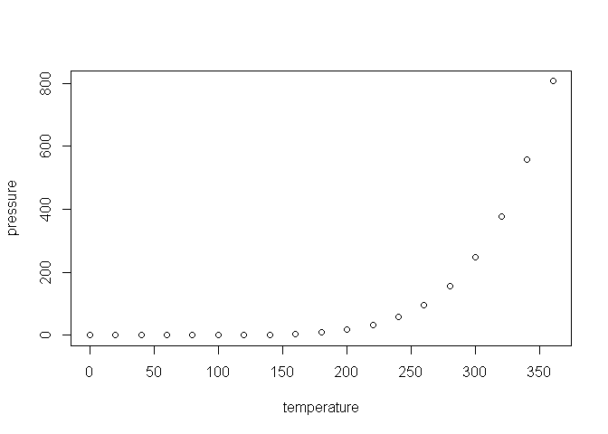

<!-- README.md is generated from README.Rmd. Please edit that file -->

# mzRAPP

<!-- badges: start -->

<!-- badges: end -->

The goal of mzRAPP is to allow reliability assessment of non-targeted
data pre-processing (NPP) in the realm of liquid chromatography high
resolution mass spectrometry (LC-HRMS). This is achieved by utilizing
user provided information on a set of molecules (at best \> 50) with
known retention behavior. mzRAPP extracts and validates chromatographic
peaks for all (envipat predicted) isotopologues of those target
molecules directly from mzML files. The resulting benchmark dataset is
used to extract different performance measures for NPP performed on the
same mzML files.

## Installation

You can install the released version of mzRAPP from
[CRAN](https://CRAN.R-project.org) with:

``` r
install.packages("mzRAPP")
```

And the development version from [GitHub](https://github.com/) with:

``` r
# install.packages("devtools")
devtools::install_github("YasinEl/mzRAPP")
```

## Example

This is a basic example which shows you how to solve a common problem:

``` r
library(mzRAPP)
#> Loading required package: data.table
#> Loading required package: enviPat
#> 
#>  
#>  Welcome to enviPat version 2.4 
#>  Check www.envipat.eawag.ch for an interactive online version
#> Loading required package: ggplot2
#> Loading required package: shiny
#> Loading required package: shinyWidgets
#> Loading required package: DT
#> 
#> Attaching package: 'DT'
#> The following objects are masked from 'package:shiny':
#> 
#>     dataTableOutput, renderDataTable
#> Loading required package: tools
#> Loading required package: plotly
#> 
#> Attaching package: 'plotly'
#> The following object is masked from 'package:ggplot2':
#> 
#>     last_plot
#> The following object is masked from 'package:stats':
#> 
#>     filter
#> The following object is masked from 'package:graphics':
#> 
#>     layout
#> Loading required package: dplyr
#> 
#> Attaching package: 'dplyr'
#> The following objects are masked from 'package:data.table':
#> 
#>     between, first, last
#> The following objects are masked from 'package:stats':
#> 
#>     filter, lag
#> The following objects are masked from 'package:base':
#> 
#>     intersect, setdiff, setequal, union
#> Loading required package: tcltk
#> Loading required package: bit64
#> Loading required package: bit
#> Attaching package bit
#> package:bit (c) 2008-2012 Jens Oehlschlaegel (GPL-2)
#> creators: bit bitwhich
#> coercion: as.logical as.integer as.bit as.bitwhich which
#> operator: ! & | xor != ==
#> querying: print length any all min max range sum summary
#> bit access: length<- [ [<- [[ [[<-
#> for more help type ?bit
#> 
#> Attaching package: 'bit'
#> The following object is masked from 'package:data.table':
#> 
#>     setattr
#> The following object is masked from 'package:base':
#> 
#>     xor
#> Attaching package bit64
#> package:bit64 (c) 2011-2012 Jens Oehlschlaegel
#> creators: integer64 seq :
#> coercion: as.integer64 as.vector as.logical as.integer as.double as.character as.bin
#> logical operator: ! & | xor != == < <= >= >
#> arithmetic operator: + - * / %/% %% ^
#> math: sign abs sqrt log log2 log10
#> math: floor ceiling trunc round
#> querying: is.integer64 is.vector [is.atomic} [length] format print str
#> values: is.na is.nan is.finite is.infinite
#> aggregation: any all min max range sum prod
#> cumulation: diff cummin cummax cumsum cumprod
#> access: length<- [ [<- [[ [[<-
#> combine: c rep cbind rbind as.data.frame
#> WARNING don't use as subscripts
#> WARNING semantics differ from integer
#> for more help type ?bit64
#> 
#> Attaching package: 'bit64'
#> The following object is masked from 'package:bit':
#> 
#>     still.identical
#> The following objects are masked from 'package:base':
#> 
#>     %in%, :, is.double, match, order, rank
#> Loading required package: hutils
#> 
#> Attaching package: 'hutils'
#> The following objects are masked from 'package:dplyr':
#> 
#>     coalesce, if_else
#> Warning: replacing previous import 'shiny::runExample' by 'shinyjs::runExample'
#> when loading 'mzRAPP'
## basic example code
```

What is special about using `README.Rmd` instead of just `README.md`?
You can include R chunks like so:

``` r
summary(cars)
#>      speed           dist       
#>  Min.   : 4.0   Min.   :  2.00  
#>  1st Qu.:12.0   1st Qu.: 26.00  
#>  Median :15.0   Median : 36.00  
#>  Mean   :15.4   Mean   : 42.98  
#>  3rd Qu.:19.0   3rd Qu.: 56.00  
#>  Max.   :25.0   Max.   :120.00
```

You’ll still need to render `README.Rmd` regularly, to keep `README.md`
up-to-date.

You can also embed plots, for example:



In that case, don’t forget to commit and push the resulting figure
files, so they display on GitHub\!
