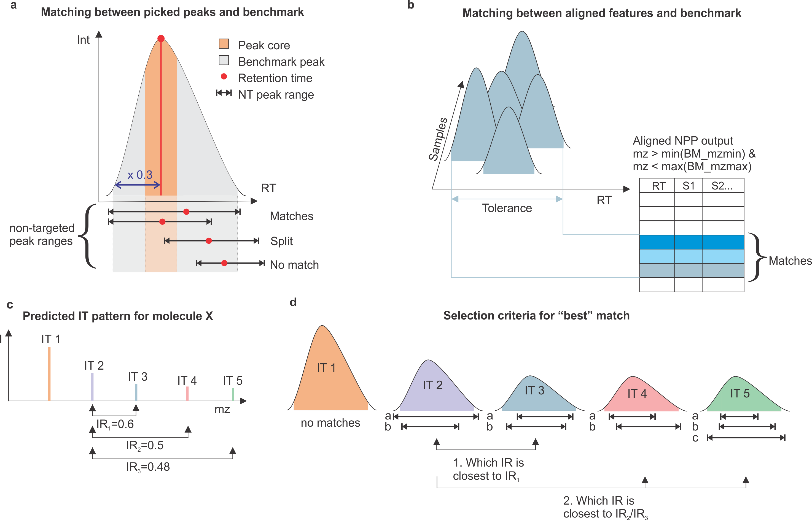
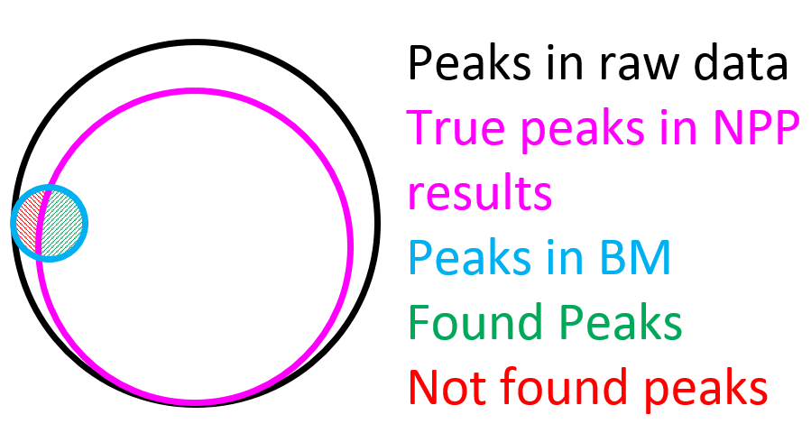
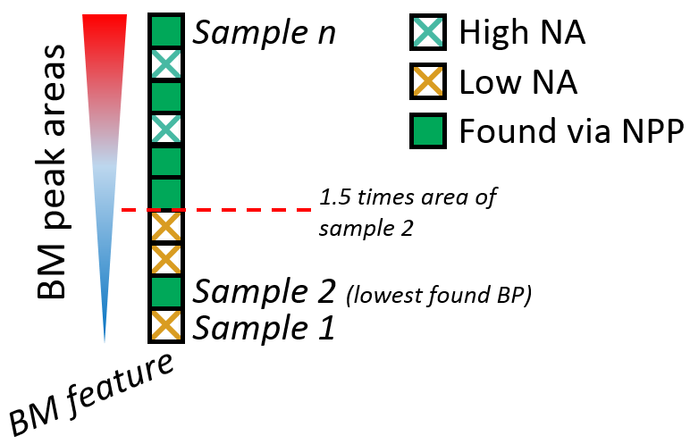
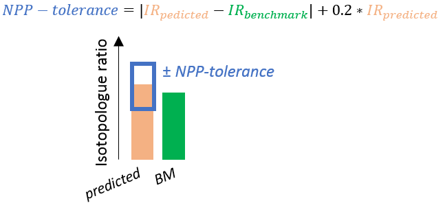
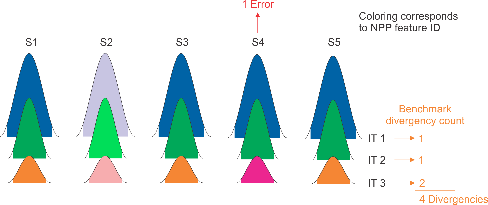

mzRAPP
================

  - [Installation](#installation)
  - [Use examples](#use-examples)
  - [Benchmark data set generation](#benchmark-data-set-generation)
      - [Select mzML files](#select-mzml-files)
      - [Select sample-group file](#select-sample-group-file)
      - [Select target file](#select-target-file)
      - [Select instrument and
        resolution](#select-instrument-and-resolution)
      - [Setting parameters](#setting-parameters)
      - [Starting benchmark generation](#starting-benchmark-generation)
      - [How check the benchmark](#how-check-the-benchmark)
      - [Generate a benchmark via
        R-script](#generate-a-benchmark-via-r-script)
  - [Reliability assessment of non-targeted data
    pre-processing](#reliability-assessment-of-non-targeted-data-pre-processing)
      - [Exporting NPP outputs from different
        tools](#exporting-npp-outputs-from-different-tools)
      - [Selecting a benchmark data set and starting
        assessment](#selecting-a-benchmark-data-set-and-starting-assessment)
      - [Perform reliability assessment via
        R-Script](#perform-reliability-assessment-via-r-script)
  - [Matching between BM and NPP output
    (background)](#matching-between-bm-and-npp-output-background)
  - [Generation and interpretation of NPP performance
    metrics](#generation-and-interpretation-of-npp-performance-metrics)
      - [Found peaks](#found-peaks)
      - [Split peaks](#split-peaks)
      - [Missing peaks](#missing-peaks)
      - [Degenerated IR](#degenerated-ir)
      - [Alignment errors](#alignment-errors)
  - [Resources](#resources)

<!-- README.md is generated from README.Rmd. Please edit that file -->

<!-- badges: start -->

<!-- badges: end -->

The goal of mzRAPP is to allow reliability assessment of non-targeted
data pre-processing (NPP) in the realm of liquid chromatography high
resolution mass spectrometry (LC-HRMS). mzRAPPs approach is based on the
increasing popularity of merging non-targeted with targeted metabolomics
meaning that both types of data evaluation are often performed on the
same same data set. Following this assumption mzRAPP can utilize user
provided information on a set of molecules (at best \> 50) with known
retention behavior. mzRAPP extracts and validates chromatographic peaks
for which boundaries are provided for all (envipat predicted)
isotopologues of those target molecules directly from mzML files. The
resulting benchmark data set is used to extract different performance
metrics for NPP performed on the same mzML files. An overview over
mzRAPP capabilities is given in this \< 3 min [youtube
video](https://www.youtube.com/watch?v=FwZ_QxZoTcI&feature=youtu.be).

## Installation

First install the most recent version of

1.  [R](https://cran.r-project.org/)
2.  [R Studio](https://rstudio.com/products/rstudio/download/) and
3.  [Rtools](https://cran.r-project.org/bin/windows/Rtools/). <br>

In case of R tools make sure you also follow the subsequent instructions
described on the webpage. <br>

Afterwards it is time to install mzRAPP. It is possible to do that by
pasting the following code into the console of R Studio and press enter.
Sometimes you are asked if you want to update packages before installing
mzRAPP. In that case select the option “None” since this often leads to
problems with the installation. If you want to update the packages just
do so before or after installing mzRAPP.

``` r
if("devtools" %in% rownames(installed.packages()) == FALSE) {install.packages("devtools")}
devtools::install_github("YasinEl/mzRAPP", auth_token = "a68cf9e8dfef3eb4bd3974aca220f49ebf034309", dependencies = TRUE)
```

Afterwards you can run mzRAPP using:

``` r
library(mzRAPP)
callmzRAPP()
```

or use mzRAPP without shiny interface as described below.

## Use examples

If you want to go through some use examples on how to use mzRAPP please
download [this
pdf](https://ucloud.univie.ac.at/index.php/s/5jdqnqEHzwn5uTX).

<span id="sBM_readme"> </span>

## Benchmark data set generation

In order to get started it is necessary to know retention times for a
minimum of 50 compounds with known molecular formulas. mzRAPP applies
this knowledge for the generation of a benchmark data set from mzML
files. This benchmark data set is supposed to include a subset of all
true peaks in those mzML files. All benchmark peak abundances are
automatically validated via isotopic pattern (in peak area and height)
and only compounds with at least two observed isotopologues are kept.
Since start- and end-time has to be provided for each compound it is
advisable to set those boundaries using a tool for manual peak curation
from which peak boundaries can be exported. One example for this would
be
[Skyline](https://skyline.ms/project/home/software/Skyline/begin.view).
Boundaries can be provided per compound or per file and compound as
described below.

<br>

### Select mzML files

In order to generate a benchmark you need to provide your
<b>centroided</b> mzML files. Conversion of files of different vendors
to mzML as well as centroiding can be done by Proteowizards
[MSconvert](http://proteowizard.sourceforge.net/tools.shtml).

<br>

### Select sample-group file

This csv file should contain two columns:

<b>sample\_name:</b> names of all mzML files from which peaks should be
extracted (with our without file extension (.mzML)) <br>
<b>sample\_group:</b> group labels of the respective samples
(e.g. treated, untreated,..). If there is only one group this still
needs to be filled out. <br> <br>

<span id="vSetupTarget"> </span>

### Select target file

This csv file should contain information on the target molecules/peaks
and include the following columns:

<b>molecule:</b> names of target molecules (should be unique
identifiers) <br> <b>adduct\_c:</b> adducts that should be evaluated
(e.g. M+H or M+Na; without brackets). If more than one adduct is to be
investigated another line with the same molecule name should be added.
All adducts enabled in the enviPat package are allowed:

``` r
library(enviPat)
#> 
#>  
#>  Welcome to enviPat version 2.4 
#>  Check www.envipat.eawag.ch for an interactive online version
data(adducts)
adducts$Name
#>  [1] "M+H"            "M+NH4"          "M+Na"           "M+K"           
#>  [5] "M+"             "M-H"            "M-2H"           "M-3H"          
#>  [9] "M+FA-H"         "M+Hac-H"        "M-"             "M+3H"          
#> [13] "M+2H+Na"        "M+H+2Na"        "M+3Na"          "M+2H"          
#> [17] "M+H+NH4"        "M+H+Na"         "M+H+K"          "M+ACN+2H"      
#> [21] "M+2Na"          "M+2ACN+2H"      "M+3ACN+2H"      "M+CH3OH+H"     
#> [25] "M+ACN+H"        "M+2Na-H"        "M+IsoProp+H"    "M+ACN+Na"      
#> [29] "M+2K-H"         "M+DMSO+H"       "M+2ACN+H"       "M+IsoProp+Na+H"
#> [33] "2M+H"           "2M+NH4"         "2M+Na"          "2M+3H2O+2H"    
#> [37] "2M+K"           "2M+ACN+H"       "2M+ACN+Na"      "M-H2O-H"       
#> [41] "M+Na-2H"        "M+Cl"           "M+K-2H"         "M+Br"          
#> [45] "M+TFA-H"        "2M-H"           "2M+FA-H"        "2M+Hac-H"      
#> [49] "3M-H"
```

<b>main\_adduct:</b> One main adduct has to be defined for each molecule
(e.g. M+H). If the main\_adduct is not detected also other adducts wont
be accepted. <br> <b>SumForm\_c:</b> Molecular composition of the
neutral molecule (e.g. C10H15N5O10P2). Please make sure there is never a
0 behind an element like behind the N in C12H8N0S2. <br>
<b>user.rtmin:</b> Start time of peak (seconds). If possible mzRAPP will
narrow peak boundaries to intersect with the extracted ion chromatogram
at 5% of the maximum peak height. It is also worth noting that peaks for
which user.rtmin/user.rtmax are provided will still be rejected if the
isotopic information is not fitting. <br> <b>user.rtmax:</b> End time of
peak (seconds). <br> <b>StartTime.EIC:</b> (optional) Start time for
chromatograms extracted for this molecule (seconds). Peaks are only
detected from this time on. If not given StartTime.EIC and EndTime.EIC
are calculated from user.rtmin and user.rtmax.<br> <b>EndTime.EIC:</b>
(optional) End time for chromatograms extracted for this molecule
(seconds). Peaks are only detected up to this time. <br>
<b>FileName:</b> (optional) Name of sample file with or without file
extension. Using this allows to apply different values (like
user.rtmin/user.rtmax) for different files. <br> <b>Additional columns:
</b> It is possible to add additional columns. Those will be kept for
the final benchmark data set. <br> <br>

### Select instrument and resolution

This is necessary in order to apply the correct mass resolution for any
given m/z value when isotopologues are predicted for different molecular
formulas. All instruments enabled via the enviPat package can be
selected from the envipat resolution list. For other instruments a
custom resolution list has to be uploaded as .csv file. This .csv file
has to consist of two columns: <br> <b>R: </b> Resolution value at half
height of a mass peak <br> <b>m/z: </b> m/z value for the corresponding
resolution <br> Resolution values for at least 10 equally distributed
m/z values are recommended.<br> <br>

### Setting parameters

In a next step a few parameters have to be set: <br> <b>Lowest iso. to
be considered \[%\]:</b> Lowest relative isotopologue abundance to be
considered for each molecule (\>= 0.05). <br> <b>Min. \# of scans per
peak:</b> Minimum number of points for a chromatographic peak to be
considered as such. <br> <b>mz precision \[ppm\]:</b> Maximum spread of
mass peaks in the mz dimension to be still considered part of the same
chromatogram. <br> <b>mz accuracy \[ppm\]:</b> Maximum difference
between the accurate mz of two ion traces to be considered to be
originating from the same ion. <br> <b>Processing plan:</b> How should
the benchmark generation be done? <u>sequential</u> (only using one
core; often slow but does not use much RAM) or <u>multiprocess</u>
(using multiple cores; faster but needs more RAM) <br> <br>

### Starting benchmark generation

Benchmark generation can be started using the blue Start button. The
necessary time for the generation depends on the number of mzML files,
the number of target compounds and of course computational resources.
Typically this process takes minutes to hours. Afterwards the generated
benchmark data set is automatically exported to the working directory as
csv file.<br> <br>

<span id="vBMID"> </span>

### How check the benchmark

An overview over different benchmark key data is provided in the “View
Benchmark” panel. The plots can be used in order to inspect different
qualities of the data set. A molecule not being detected does not
necessarily mean that there is no peak, but that mzRAPP was not able to
validate it. This could happen if less than two isotopologues
(full-filling strict criteria in abundance, peak shape correlation and
number of points per peak) which is required for a given molecule to be
kept in the given file. In order to get a better overview over picked
peaks two csv files as well as instructions can be exported. Those can
(but does not have to) be used in order to generate a mirror image of
the benchmark data set in the free software
[Skyline](https://skyline.ms/project/home/software/Skyline/begin.view).

When the benchmark is satisfactory it can be used for reliability
assessment of non targeted data pre-processing as explained in the
following chapter.

### Generate a benchmark via R-script

``` r
#load packages
library(mzRAPP)
library(enviPat)

#load resolution data & select instrument/resolution
data("resolution_list") 
res_list <- resolution_list[["OTFusion,QExactiveHF_120000@200"]]

#calculate theoretic mz values and abundances for all isotopologues at the given mass resolution using enviPat
Th_isos <- get_mz_table(targets, #table with information on target molecules as described above
                      instrumentRes = res_list
                      )

#find regions of interest (ROIs)/for theoretic isotopoplogues
rois <- get_ROIs(files = files, #vector of mzML file names (including paths)
                      Target.table = Th_isos,
                      PrecisionMZtol = 5, #mass precision of the used mass spectrometer
                      AccurateMZtol = 5 #mass accuracy of the used mass spectrometer
                      )

#Extract/evaluate peaks
PCal <- find_bench_peaks(files = files, #vector of mzML file names (including paths) as described above
                      Grps = grps, #table including information on group assignment of each provided mzML file as described above
                      CompCol_all = rois,
                      Min.PointsperPeak = 8, #minimum number of points expected from a given peak
                      max.mz.diff_ppm = 5 #mass accuracy of the used mass spectrometer
)

#save the resulting benchmark to a csv file
fwrite(PCal, file = "Peak_list.csv", row.names = FALSE)
```

<span id="sNPP_readme"> </span>

## Reliability assessment of non-targeted data pre-processing

Reliability assessment of NPP can be set up in the panel “Setup NPP
assessment”. First the tool to be evaluated has to be set. Afterwards
the unaligned and aligned output files of the tools to be assessed have
to be selected. The way those files can be exported from different tools
are lined out in the following. In case of all those outputs it should
be noted that mzRAPP is heavily depending on all isotopologues being
reported in the output feature tables. For that reason they must not be
filtered out for mzRAPP to work properly.<br>

### Exporting NPP outputs from different tools

<u>XCMS (R-version):</u>

``` r
#unaligned file:
data.table::fwrite(xcms::peaks(xcmsSet_object), "blabla_unaligned_file.csv")

#aligned file:
data.table::fwrite(xcms::peakTable(xcmsSet_object), "blabla_aligned_file.csv")
```

<br> <u>XCMS online:</u> <br> When starting a run on XCMS online make
sure that retention times are always given in seconds. After processing
download all results from XCMS online via the button “Download Results”.
Afterwards extract all Results from the zipped folder. <br> unaligned
file: select the xcms3xset.Rda file <br> aligned file: select the same
xcms3xset.Rda file <br> <br> <u>MS-DIAL:</u> <br> unaligned files:
Export -\> Peak list result -\> \[Add all files\] -\> \[set Export
format to txt\] <br> aligned file: When performing the alignment make
sure to activate the isotope tracking option in the alignment step (for
most cases selecting 13C and 15N as labeling elements will be adequate).
Afterwards export via: Export -\> Alignment result -\> \[check Raw data
matrix Area\] -\> \[set Export format to msp\] <br> <br> <u>mzMine:</u>
<br> unaligned files: \[select all files generated in the chromatogram
deconvolution step\] -\> Feature list methods -\> Export/Import -\>
Export to CSV file -\> \[set Filename including pattern/curly brackets
(e.g. blabla\_{}\_blabla.csv)\] -\> \[check “Peak name”, “Peak height”,
“Peak area”, “Peak RT start”, “Peak RT end”, “Peak RT”, “Peak m/z”,
“Peak m/z min” and “Peak m/z max”\] -\> \[set Filter rows to ALL\]
<br> aligned file: \[select file after alignment step\] -\> Feature list
methods -\> Export/Import -\> Export to CSV file -\> \[additional to
checks set for unaligned files check “Export row retention time” and
“Export row m/z”\]<br> <br> <u>El-MAVEN:</u> <br> unaligned file:
\[click the “Export csv” button in the “Peak Table”-panel\] -\> Export
all groups -\> \[select “Peaks Detailed Format Comma Delimited (.csv)”\]
<br> aligned file: \[click the “Export csv” button in the “Peak
Table”-panel\] -\> Export all groups -\> \[select “Groups Summary
Matrix Format Comma Delimited (.csv)”\] <br> <br> <u>OpenMS:</u> <br>
When processing the FeatureFinderMetabo algorithm make sure to set
local\_rt\_range as well as local\_mz\_range to 0. You will have to
check ‘Show advanced parameters’ to make those parameters visible. Also
set report\_covex\_hulls to true. <br> unaligned file: \[Connect a
TextExporter node with separator set to ‘,’ directly to the
FeatureFinderMetabo node\] -\> \[connect TextExporter to Output Folder\]
<br> aligned file: \[Connect a TextExporter node with separator set to
‘,’ directly to the FeatureLinkerUnlabeledQT node\] -\> \[connect
TextExporter to Output Folder\] <br> <br> <u>Compound Discoverer:</u>
<br> unaligned file: \[go to panel “Features”\] -\> \[click in any row\]
-\> \[click “Show related Tables” on the bottom of the screen\] -\> \[go
to panel “Chromatogram Peaks”\] -\> \[make sure the columns “Apex
Intensity”, “Area”, “Study File ID”, “Left RT \[min\]”, “Right RT
\[min\]” “Apex RT \[min\]” and “Apex m/z” are visible\] -\> \[right
click any row\] -\> Export -\> As plain text… <br> aligned file:
currently it is not possible to use aligned files from Compound
Discoverer <br> <br> <u>PatRoon:</u> <br> patRoon is not supported
directly but can still be loaded since it allows to generate
<i>xcmsSet</i> objects internally. Hence, it has to be loaded into
mzRAPP as “XCMS” output which has to be stated as such in the “Setup NPP
assessment tab”.

``` r
xcmsSet_object <- patRoon::getXCMSSet(patRoon_features_object)

#unaligned file:
data.table::fwrite(xcms::peaks(xcmsSet_object), "blabla_unaligned_file.csv")

#aligned file:
data.table::fwrite(xcms::peakTable(xcmsSet_object), "blabla_aligned_file.csv")
```

<br> <u>any other tool:</u> <br> It is also possible to use the outputs
of other tools. However, they have to be adapted in a way that they
resemble the output of one of the tools listed above. If this is not
possible for some cases but important to you please contact me at
<yasin.el.abiead@univie.ac.at> <br>

### Selecting a benchmark data set and starting assessment

Next the benchmark file has to be selected. If a benchmark has been
created during this shiny session (the benchmark is still visible in the
panel benchmark overview) the switch button “Use generated benchmark”
can be clicked as an alternative. <br> <br> After performing those steps
the assessment can be started via the blue “Start assessment button”.
<br>

### Perform reliability assessment via R-Script

``` r

#select the output format of which tool you would like to read in (exportable from the different tools as described above)
#options: XCMS, El-Maven, OpenMS, msDial or mzMine
algo = "XCMS"

#load benchmark csv file
benchmark <- check_benchmark_input(file = "Path_to_benchmark_csv_file.csv",
                              algo = algo
                              )


#load non-targeted output
NPP_output <- check_nonTargeted_input(ug_table_path = "Path_to_unaligned_Output_csv_file.csv/.txt", #in case of multiple files (e.g. for MS-DIAL) supply a vector of paths
                             g_table_path = "Path_to_aligned_Output_csv_file.csv/.txt", 
                             algo = algo
                             )

#compare benchmark with non-targeted output
comparison <- compare_peaks(b_table = benchmark$b_table,
                            ug_table = NPP_output$ug_table,
                            g_table = NPP_output$g_table,
                            algo = algo
                            )

#generate a list including different statistics of the comparison
comp_stat <- derive_performance_metrics(comparison)

#generate different sunburst plots for overview
plot_sunburst_peaks(comp_stat, comparison)
plot_sunburst_peakQuality(comp_stat, comparison)
plot_sunburst_alignment(comp_stat)
```

<span id="Matching_peaks"> </span>

## Matching between BM and NPP output (background)

Before any NPP-performance metrics can be generated mzRAPP is matching
the non-targeted data pre-processing (NPP) output files against the
benchmark (BM). The ways in which this is done are explained in the
following.

<h3>

Comparison of benchmark with non-targeted output

</h3>

<b>Matching of benchmark peaks with NT peaks before alignment:</b> <br>
Each benchmark peak (BP) is reported with the smallest and highest mz
value contributing to the chromatographic peak. In order to be
considered as possible match for a BP a NT peak (NP) has to come with an
mz value between those two values. Matching rules considering retention
time (RT) are depicted in Figure 1a. A NP has to cover the whole core of
a BP while having a RT within the borders (RTmin, RTmax) of the BP. If
only a part of the core is covered by a NP with its RT in the borders of
the BP, the NP it is counted as a split peak. NPs which are not
overlapping with the core of a BP are not considered. In some cases
there can be more than one match between a BP and NPs (Figure 1d). In
those cases, BPs corresponding to the same molecule but other
isotopologues (IT) are considered to choose the NP leading to the
smallest relative IT ratio (calculated via reported peak abundances)
bias as compared to the predicted IT-ratio (Figure 1c). When more than
two different IT are detected the ratio of each IT with the highest IT
reported via NPP is considered.

<div class="figure">



<p class="caption">

<b>Figure 1 | </b> Matching between BM and NPP output

</p>

</div>

<br> <b>Matching of benchmark features with non-targeted features:</b>
<br> For a NT feature (NF) to be considered as match for a benchmark
feature (BF) its reported mz and RT value have to lie between the
lowest/highest benchmark peak mzmin/mzmax and RTmin/RTmax of the
considered benchmark feature, respectively (Figure 1b). In case of
multiple matches for the same BF the same strategy as for NP is applied
(Figure 1c and d). However, in case of features the mean area is
calculated over all samples for which a BP is present. <br>

<b>Matching of non-targeted peaks to non-targeted features:</b> <br> In
order to count alignment errors (explained below) it is necessary to
trace non-targeted peaks (NP) reported before alignment in the
non-targeted features (NF) of the aligned file. This is done by matching
the exact area reported in an unaligned file on the same area in the
aligned file. This generally works since areas usually do not change
during alignment process. In rare exceptions (MS-DIAL) areas have to be
rounded before comparison. If a peak can not be detected in the aligned
file but was detected in the unaligned file it is considered as being
lost during the alignment process which is reported in one of the
performance metrics (see below).

<span id="MetricsID"> </span>

## Generation and interpretation of NPP performance metrics

Reliability assessment results can be inspected in the panel “View NPP
assessment” or can be generated using R-functions (shown below). Using
the shiny user interface different performance metrics are given at the
top of the panel. All metrics are given with an empirical confidence
interval (alpha = 0.95) in percent which is supposed to be
representative for the entirety of (unknown) peaks in the provided raw
data (mzML files). It is calculated by summing up different metrics
(which are described below) per molecule and then bootstrapping
molecules (R = 1000). Confidence intervals with values \< 0 are round up
to 0. <br> <br>

### Found peaks

The number of benchmark peaks for which a match was found among the
unaligned/aligned NPP results vs all peaks present in benchmark (as
shown in figure 2). For explanations on how the matching of benchmark
peaks with non-targeted peaks is performed please read the section
“Matching of benchmark peaks with NT peaks before alignment”
above.<br> <br> <i>Number of benchmark peaks with at least one NPP match
/ Number of benchmark peaks (confidence interval)</i>

<div class="figure">



<p class="caption">

<b>Figure 2 | </b> Overview of different peak populations

</p>

</div>

### Split peaks

The number of split peaks which have been found for all benchmark peaks.
For a graphical explanation of a split peak please check figure 1a. It
is worth noting that there can be more than one split peak per benchmark
peak. <br> <br> <i>Number of split peaks found over all benchmark peaks
/ (Number of benchmark peaks with at least one NPP match + Number of
split peaks found over all benchmark peaks) (confidence interval)</i>
<br>

<span id="Missing_values"> </span>

### Missing peaks

The classification of not found peaks (Not found peaks, as defined in
figure 2) into high and low is done for each benchmark feature
individually. Since we do not want to solely rely on the benchmark
alignment to be correct we only classify missing values if alignment of
the benchmark is in agreement with the alignment performed by NPP in at
least one isotopologue (as also described in figure 5). Classification
is based on the lowest benchmark peak present in the respective feature
which has been found by the non-targeted algorithm. All benchmark peaks
in this feature which have a benchmark area which is more than 1.5 times
higher than the lowest benchmark peak found via the non-targeted
approach are considered high. Otherwise they are considered as low.
Additionally there is the class of lost peaks. This classification means
that no peak has been found over the whole feature. <br> <br> <i>Number
of high missing values / (Number of high missing values + Number of low
missing values) (confidence interval)</i>

<div class="figure">



<p class="caption">

<b>Figure 3 | </b> Diffentiation between classes of missing peaks/values

</p>

</div>

<span id="Peak_quality"> </span>

### Degenerated IR

Isotopologue abundance rations (IR) are calculated relative to the
highest isotopologue of each molecule. If the relative bias of an IR
bias calculated using NPP-abundances is exceeding the tolerance
(outlined in figure 4) it is reflected in this variable. <br> <br>
<i>Number of isotopologue ratio exceeding tolerance / Number of
isotopologue ratios which can be calculated using reported NPP
abundances (confidence interval)</i>

<div class="figure">



<p class="caption">

<b>Figure 4 | </b> Calculation of NPP abundance bias tolerance

</p>

</div>

<span id="Alignment_counting"> </span>

### Alignment errors

We use a form of benchmark-critical error counting which counts the
minimum number of alignment errors without relying on correct alignment
of the benchmark data set itself. Figure 5 shows three isotopologues
(IT) of the same benchmark molecule detected in 5 samples. The color
coding indicates the feature the peak has been assigned to by the NPP
algorithm. Whenever there is an asymmetry in the assignment of the
different IT the minimum number of steps to reverse that asymmetry are
counted as errors. Counting benchmark divergences as errors, assumes
correct alignment of the benchmark data set. Finally lost peaks
correspond to the peaks which have been matched from the peak detection
step but which are not present anymore after the alignment step. All
those counts are given in the output of the NPP-assessment. <br> <br>
<i>Number of one of three error-types / Number of benchmark peaks for
which an NPP-match has been found (confidence interval)</i>

<div class="figure">



<p class="caption">

<b>Figure 5 | </b> Counting alignment errors

</p>

</div>

## Resources

mzRAPP is based on many other R packages. Specifically it depends on
(<b>data.table, ggplot2, shinyjs and dplyr</b>) and imports
(<b>shinybusy, shinydashboard, shiny, shinyWidgets, doFuture, plotly,
tcltk, hutils, DT, tools, retistruct, xcms, multtest, enviPat, stats,
parallel, doBy, shinycssloaders, BiocParallel, doParallel, MSnbase,
DescTools, signal, intervals, future.apply, foreach, S4Vectors, V8,
boot, future, bit64, htmltools, kableExtra, shinythemes and knitr <b/>)
packages from R Cran and Bioconductor. Moreover, we implemented code
from two different Stackoverflow contributions
(<b><https://stackoverflow.com/questions/37169039/direct-link-to-tabitem-with-r-shiny-dashboard?rq=1>
and
<https://stackoverflow.com/questions/57395424/how-to-format-data-for-plotly-sunburst-diagram></b>)
