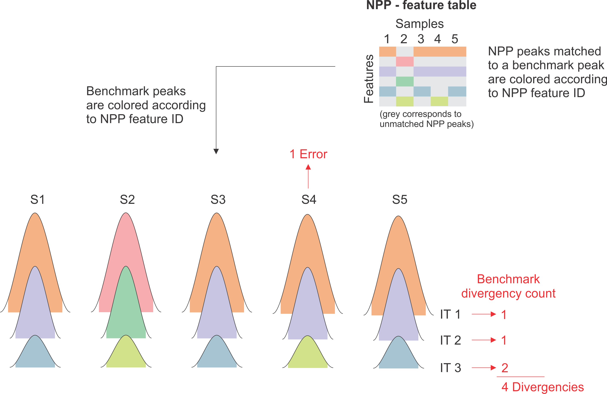

mzRAPP
================

  - [Installation](#installation)
  - [Benchmark data set generation](#benchmark-data-set-generation)
      - [Select mzML files](#select-mzml-files)
      - [Select sample-group file](#select-sample-group-file)
      - [Select target file](#select-target-file)
      - [Select instrument and
        resolution](#select-instrument-and-resolution)
      - [Setting parameters](#setting-parameters)
      - [Starting benchmark generation](#starting-benchmark-generation)
      - [How to edit the benchmark data
        set](#how-to-edit-the-benchmark-data-set)
  - [Reliability assessment of non-targeted data
    pre-processing](#reliability-assessment-of-non-targeted-data-pre-processing)
      - [Exporting NPP outputs from different
        tools](#exporting-npp-outputs-from-different-tools)
      - [Selecting a benchmark data set and starting
        assessment](#selecting-a-benchmark-data-set-and-starting-assessment)
  - [Matching between BM and NPP output
    (background)](#matching-between-bm-and-npp-output-background)
  - [Generation and interpretation of NPP performance
    metrics](#generation-and-interpretation-of-npp-performance-metrics)
      - [Found peaks](#found-peaks)
      - [Split peaks](#split-peaks)
      - [Missing peaks (high/(high+low))](#missing-peaks-highhighlow)
      - [Degenerated IR](#degenerated-ir)
      - [Alignment errors](#alignment-errors)

<!-- README.md is generated from README.Rmd. Please edit that file -->

<!-- badges: start -->

<!-- badges: end -->

The goal of mzRAPP is to allow reliability assessment of non-targeted
data pre-processing (NPP) in the realm of liquid chromatography high
resolution mass spectrometry (LC-HRMS). mzRAPPs approach is based on the
increasing popularity of merging non-targeted with targeted metabolomics
meaning that both types of data evaluation are often performed on the
same same data set. Following this assumption mzRAPP can utilize user
provided information on a set of molecules (at best \> 50) with known
retention behavior. mzRAPP extracts and validates chromatographic peaks
for which boundaries are provieded for all (envipat predicted)
isotopologues of those target molecules directly from mzML files. The
resulting benchmark data set is used to extract different performance
metrics for NPP performed on the same mzML files.

## Installation

First install the most recent version of

1.  [R](https://cran.r-project.org/)
2.  [R Studio](https://rstudio.com/products/rstudio/download/) and
3.  [Rtools](https://cran.r-project.org/bin/windows/Rtools/). <br>

In case of R tools make sure you also follow the subsequent instructions
described on the webpage. Afterwards you can install mzRAPP using:

``` r
if("devtools" %in% rownames(installed.packages()) == FALSE) {install.packages("devtools")}
devtools::install_github("YasinEl/mzRAPP", dependencies = TRUE)
```

Afterwards you can run mzRAPP using:

``` r
library(mzRAPP)
callmzRAPP()
```

or use mzRAPP without shiny interface as described below.

<span id="sBM_readme"> </span>

## Benchmark data set generation

In order to get started it is necessary to know retention times for a
minimum of 50 compounds with known molecular formulas. mzRAPP applies
this knowledge for the generation of a benchmark data set from mzML
files. This benchmark data set is supposed to include a subset of all
true peaks in those mzML files. All benchmark peak abundances are
automatically validated via isotopic pattern (in peak area and height)
and only compounds with at least two observed isotopologues are kept.
Since start- and end-time has to be provided for each compound it is
advisable to set those boundaries using a tool for manual peak curation
from which peak boundaries can be exported. One example for this would
be
[Skyline](https://skyline.ms/project/home/software/Skyline/begin.view).
Boundaries can be provided per compound or per file and compound as
described below.

<br>

### Select mzML files

In order to generate a benchmark you need to provide your
<b>centroided</b> mzML files. Conversion of files of different vendors
to mzML as well as centroiding can be done by Proteowizards
[MSconvert](http://proteowizard.sourceforge.net/tools.shtml).

<br>

### Select sample-group file

This csv file should contain two columns:

<b>sample\_name:</b> names of all mzML files from which peaks should be
extracted (with our without file extension (.mzML)) <br> <br>
<b>sample\_group:</b> group labels of the respective samples
(e.g. treated, untreated,..). If there is only one group this still
needs to be filled out. <br> <br>

<span id="vSetupTarget"> </span>

### Select target file

This csv file should contain information on the target molecules/peaks
and include the following columns:

<b>molecule:</b> names of target molecules (should be unique
identifiers) <br> <br> <b>adduct\_c:</b> adducts that should be
evaluated (e.g. M+H or M+Na; without brackets). If more than one adduct
is to be investigated another line with the same molecule name should be
added. All adducts enabled in the enviPat package are allowed:

``` r
library(enviPat)
#> 
#>  
#>  Welcome to enviPat version 2.4 
#>  Check www.envipat.eawag.ch for an interactive online version
data(adducts)
adducts$Name
#>  [1] "M+H"            "M+NH4"          "M+Na"           "M+K"           
#>  [5] "M+"             "M-H"            "M-2H"           "M-3H"          
#>  [9] "M+FA-H"         "M+Hac-H"        "M-"             "M+3H"          
#> [13] "M+2H+Na"        "M+H+2Na"        "M+3Na"          "M+2H"          
#> [17] "M+H+NH4"        "M+H+Na"         "M+H+K"          "M+ACN+2H"      
#> [21] "M+2Na"          "M+2ACN+2H"      "M+3ACN+2H"      "M+CH3OH+H"     
#> [25] "M+ACN+H"        "M+2Na-H"        "M+IsoProp+H"    "M+ACN+Na"      
#> [29] "M+2K-H"         "M+DMSO+H"       "M+2ACN+H"       "M+IsoProp+Na+H"
#> [33] "2M+H"           "2M+NH4"         "2M+Na"          "2M+3H2O+2H"    
#> [37] "2M+K"           "2M+ACN+H"       "2M+ACN+Na"      "M-H2O-H"       
#> [41] "M+Na-2H"        "M+Cl"           "M+K-2H"         "M+Br"          
#> [45] "M+TFA-H"        "2M-H"           "2M+FA-H"        "2M+Hac-H"      
#> [49] "3M-H"
```

<b>main\_adduct:</b> One main adduct has to be defined for each molecule
(e.g. M+H). If the main\_adduct is not detected also other adducts wont
be accepted. <br> <br> <b>SumForm\_c:</b> Molecular composition of the
neutral molecule (e.g. C10H15N5O10P2). Please make sure there is never a
0 behind an element like behind the N in C12H8N0S2. <br> <br>
<b>StartTime.EIC:</b> Start time for chromatograms extracted for this
molecule (seconds). Peaks are only detected from this time on. <br> <br>
<b>EndTime.EIC:</b> End time for chromatograms extracted for this
molecule (seconds). Peaks are only detected up to this time. <br> <br>
<b>user.rtmin:</b> Start time of peak (seconds). Peak boundaries will
also be narrowed to intesect with the extracted ion chromatogram at 10%
peak height. It is also worth noting that peaks for which
user.rtmin/user.rtmax are provided will still be rejected if the
isotopic information is fitting. <br> <br> <b>user.rtmax:</b> End time
of peak (seconds). <br> <br> <b>FileName:</b> (optional) Name of sample
file with or without file extension. Using this different
user.rtmin/user.rtmax values can be used for each sample. <br> <br>
<b>Additional columns: </b> It is possible to add additional columns.
Those will be kept for the final benchmark data set. <br> <br>

### Select instrument and resolution

This is necessary in order to apply the correct mass resolution for any
given m/z value when isotopologues are predicted for different molecular
formulas. All instruments enabled via the enviPat package can be
selected from the envipat resolution list. For other instruments a
custom resolution list has to be uploaded as .csv file. This .csv file
has to consist of two columns: <br> <b>R: </b> Resolution value at half
height of a mass peak <br> <b>m/z: </b> m/z value for the corresponding
resolution <br> Resolution values for at least 10 equally distributed
m/z values are recommended.<br> <br>

### Setting parameters

In a next step a few parameters have to be set: <br> <b>Lowest iso. to
be considered \[%\]:</b> Lowest relative isotopologue abundance to be
considered for each molecule (\>= 0.05). <br> <b>Min. \# of scans per
peak:</b> Minimum number of points for a chromatographic peak to be
considered as such. <br> <b>mz precision \[ppm\]:</b> Maximum spread of
mass peaks in the mz dimension to be still considered part of the same
chromatogram. <br> <b>mz accuracy \[ppm\]:</b> Maximum difference
between the accurate mz of two ion traces to be considered to be
originating from the same ion. <br> <b>Processing plan:</b> How should
the benchmark generation be done? <u>sequential</u> (only using one
core; often slow but does not use much RAM) or <u>multiprocess</u>
(using multiple cores; faster but needs more RAM) <br> <br>

### Starting benchmark generation

Benchmark generation can be started using the blue Start button. The
necessary time for the generation depends on the number of mzML files,
the number of target compounds and of course computational resources.
Typically this process takes minutes to hours. Afterwards the generated
benchmark data set is automatically exported to the working directory as
csv file.<br> <br>

<span id="vBMID"> </span>

### How to edit the benchmark data set

An overview over different benchmark key data is provided in the “View
Benchmark” panel. The plots can be used in order to inspect different
qualities of the data set. A molecule not being detected does not
necessarily mean that there is no peak, but that mzRAPP was not able to
validate it. This could happen if less than two isotopologues
(full-filling strict criteria in abundance and peak shape correlation
and number of points per peak) were detected as two isotopologues are
required for each molecule in each file to be kept in the respective
file. In order to get a better overview over picked peaks two csv files
as well as instructions can be exported. Those can be used in order to
generate a mirror image of the benchmark data set in the free software
[Skyline](https://skyline.ms/project/home/software/Skyline/begin.view).
Notably Skyline can also be used to adapt peak boundaries or add peaks
which might have been missed by mzRAPP. However, it is only possible to
make those adaptations for the most abundant isotopologue of the
main\_adduct. Other peaks will always be detected automatically by
mzRAPP within the boundaries of that main-peak. Afterwards a new
target-csv file can be prepared as described above (using the columns
user.rtmin, user.rtmax and FileName). Finally the benchmark generation
has to be repeated with this adapted target file.<br>

When the benchmark is satisfactory it can be used for reliability
assessment of non targeted data pre-processing as explained in the
following chapter.

<span id="sNPP_readme"> </span>

## Reliability assessment of non-targeted data pre-processing

Reliability assessment of NPP can be set up in the panel “Setup NPP
assessment”. First the tool to be evaluated has to be set. Afterwards
the unaligned and aligned output files of the tools to be assessed have
to be selected. The way those files can be exported from different tools
are lined out in the following. <br> <br>

### Exporting NPP outputs from different tools

<u>XCMS (R-version):</u>

``` r
#unaligned file:
data.table::fwrite(xcms::peaks(xcmsSet_object), "blabla_unaligned_file.csv")

#aligned file:
data.table::fwrite(xcms::peakTable(xcmsSet_object), "blabla_aligned_file.csv")
```

<br> <u>XCMS online:</u> <br> Download all results from XCMS online via
the button “Download Results”. Afterwards extract all Results from the
zipped folder. <br> unaligned file: select the xcms3xset.Rda file <br>
aligned file: select the same xcms3xset.Rda file <br> <br>
<u>MS-DIAL:</u> <br> unaligned files: Export -\> Peak list result -\>
\[Add all files\] -\> \[set Export format to txt\] <br> aligned file:
When performing the alignment make sure to activate the isotope tracking
option in the alignment step (for most cases selecting 13C and 15N as
labeling elements will be adequat). Afterwards export via: Export -\>
Alignment result -\> \[check Raw data matrix Area\] -\> \[set Export
format to txt\] <br> <br> <u>mzMine:</u> <br> unaligned files: \[select
all files generated in the chromatogram deconvolution step\] -\> Feature
list methods -\> Export/Import -\> Export to CSV file -\> \[set Filename
including pattern/curly brackets (e.g. blabla\_{}\_blabla.csv)\] -\>
\[check “Peak name”, “Peak height”, “Peak area”, “Peak RT start”, “Peak
RT end”, “Peak RT”, “Peak m/z”, “Peak m/z min” and “Peak m/z max”\] -\>
\[set Filter rows to ALL\] <br> aligned file: \[select file after
alignment step\] -\> Feature list methods -\> Export/Import -\> Export
to CSV file -\> \[additional to checks set for unaligned files check
“Export row retention time” and “Export row m/z”\]<br> <br>
<u>El-MAVEN:</u> <br> unaligned file: \[click the “Export csv” button in
the “Peak Table”-panel\] -\> Export all groups -\> \[select “Peaks
Detailed Format Comma Delimited (.csv)”\] <br> aligned file: \[click the
“Export csv” button in the “Peak Table”-panel\] -\> Export all groups
-\> \[select “Groups Summary Matrix Format Comma Delimited (.csv)”\]
<br> <br> <u>OpenMS:</u> <br> When processing the FeatureFinderMetabo
algorithm make sure to set local\_rt\_range as well as local\_mz\_range
to 0. You will have to check ‘Show advanced parameters’ to make those
parameters visible. Also set report\_covex\_hulls to true. <br>
unaligned file: \[Connect a TextExporter node with seperator set to ‘,’
directly to the FeatureFinderMetabo node\] -\> \[connect TextExporter to
Output Folder\] <br> aligned file: \[Connect a TextExporter node with
seperator set to ‘,’ directly to the FeatureLinkerUnlabeledQT node\] -\>
\[connect TextExporter to Output Folder\] <br> <br> <u>Compound
Discoverer:</u> <br> unaligned file: \[go to panel “Features”\] -\>
\[click in any row\] -\> \[click “Show related Tables” on the bottom of
the screen\] -\> \[go to panel “Chromatogram Peaks”\] -\> \[make sure
the columns “Apex Intensity”, “Area”, “Study File ID”, “Left RT
\[min\]”, “Right RT \[min\]” “Apex RT \[min\]” and “Apex m/z” are
visible\] -\> \[right click any row\] -\> Export -\> As plain text… <br>
aligned file: currently it is not possible to use aligned files from
Compound Discoverer <br> <br>

### Selecting a benchmark data set and starting assessment

Next the benchmark file has to be selected. If a benchmark has been
created during this shiny session (the benchmark is still visible in the
panel benchmark overview) the switch button “Use generated benchmark”
can be clicked as an alternative. <br> <br> After performing those steps
the assessment can be started via the blue “Start assessment button”.
<br>

<span id="Matching_peaks"> </span>

## Matching between BM and NPP output (background)

Before any NPP-performance metrics can be generated mzRAPP is matching
the non-targeted data pre-processing (NPP) output files against the
benchmark (BM). The ways in which this is done are explained in the
following.

<h3>

Comparison of benchmark with non-targeted output

</h3>

<b>Matching of benchmark peaks with NT peaks before alignment:</b> <br>
Each benchmark peak (BP) is reported with the smallest and highest mz
value contributing to the chromatographic peak. In order to be
considered as possible match for a BP a NT peak (NP) has to come with an
mz value between those two values. Matching rules considering retention
time (RT) are depicted in Figure 1. A NP has to cover the whole core of
a BP while having a RT within the borders (RTmin, RTmax) of the BP. If
only a part of the core is covered by a NP with its RT in the borders of
the BP, the NP it is counted as a split peak. NPs which are not
overlapping with the core of a BP are not considered. If there is more
than one NP matching to a single BP, BPs corresponding to the same
molecule but other isotopologues (IT) are considered to choose the NP
leading to the smallest relative IT ratio bias (as compared to the
predicted ratio; see figure 3) as compared to the predicted IT-ratio.

<div class="figure">


<p class="caption">

<b>Figure 1 | </b> Matching rules of BP with NP

</p>

</div>

<br> <b>Matching of benchmark features with non-targeted features:</b>
<br> For a NT feature (NF) to be considered as match for a benchmark
feature (BF) its reported mz and RT value have to lie between the
lowest/highest benchmark peak mzmin/mzmax and RTmin/RTmax of the
considered benchmark feature, respectively. In case of multiple NF
matching to the same BF the NF leading to smallest relative mean
isotopologue ratio bias (as compared to the predicted ratio; see figure
3) over all NPs is selected (only NPs in samples which are also
populated by a BP are considered for the IT ratio bias calculation).
<br>

<b>Matching of non-targeted peaks to non-targeted features:</b> <br> In
order to count alignment errors (explained below) it is necessary to
trace non-targeted peaks (NP) reported before alignment in the
non-targeted features (NF) of the aligned file. This is done by matching
the exact area reported in an unaligned file on the same area in the
aligned file. This generally works since areas usually do not change
during alignment process. In rare exceptions (MS-DIAL) areas have to be
rounded before comparison. If a peak can not be detected in the aligned
file but was detected in the unaligned file it is considered as being
lost during the alignment process which is reported in one of the
performance metrics (see below).

<span id="MetricsID"> </span>

## Generation and interpretation of NPP performance metrics

Reliability assessment results can be inspected in the panel “View NPP
assessment” or can be generated using R-functions (shown below). Using
the shiny user interface the following performance metrics are given at
the top of the panel: <br> <br>

### Found peaks

The number of benchmark peaks for which a match was found among the
unaligned/aligned NPP results vs all peaks present in benchmark (as
shown in figure 2). For explanations on how the matching of benchmark
peaks with non-targeted peaks is performed please read the section
“Matching of benchmark peaks with NT peaks before alignment”
above.<br>

<div class="figure">


<p class="caption">

<b>Figure 2 | </b> Overview of different peak populations

</p>

</div>

### Split peaks

The number of split peaks which have been found for all benchmark peaks.
For a graphical explanation of a split peak please check figure 1. It is
worth noting that there can be more than one split peak per benchmark
peak. <br>

<span id="Missing_values"> </span>

### Missing peaks (high/(high+low))

The classification of not found peaks (NAs, as defined in figure 2) into
high and low is done for each benchmark feature individually. It is
based on the lowest benchmark peak present in the respective feature
which has been found by the non-targeted algorithm. All benchmark peaks
in this feature which have a benchmark area which is more than 1.5 times
higher than the lowest benchmark peak found via the non-targeted
approach are considered high. Otherwise they are considered as low.

<div class="figure">


<p class="caption">

<b>Figure 3 | </b> Diffentiation between classes of missing peaks/values

</p>

</div>

<span id="Peak_quality"> </span>

### Degenerated IR

Isotopologue abundance rations (IR) are calculated relative to the
highest isotopologue of each molecule. If the relative bias of an IR
calculated using NPP-abundances is exceeding the tolerance (outlined in
figure 4) it is reflected in this variable.

<div class="figure">


<p class="caption">

<b>Figure 4 | </b> Calculation of NPP abundance bias tolerance

</p>

</div>

<span id="Alignment_counting"> </span>

### Alignment errors

Benchmark-critical counting counts the minimum number of alignment
errors without relying on correct alignment of the benchmark data set
itself. Figure 5 shows three isotopologues (IT) of the same benchmark
molecule detected in 5 samples. The color coding indicates the feature
the peak has been assigned to by the NPP algorithm. Whenever there is an
asymmetry in the assignment of the different IT the minimum number of
steps to reverse that asymmetry are counted as errors. Counting
benchmark divergences as errors, assumes correct alignment of the
benchmark data set. This kind of counting should only be done after
visual inspection of the benchmark data set. Both counts are given in
the output of the NPP-assessment.

<div class="figure">



<p class="caption">

<b>Figure 5 | </b> Counting alignment errors

</p>

</div>

<b>Overview plots:</b><br> <br> For explanations of the overview plots
please click the blue question marks above the individual plots. <br>
