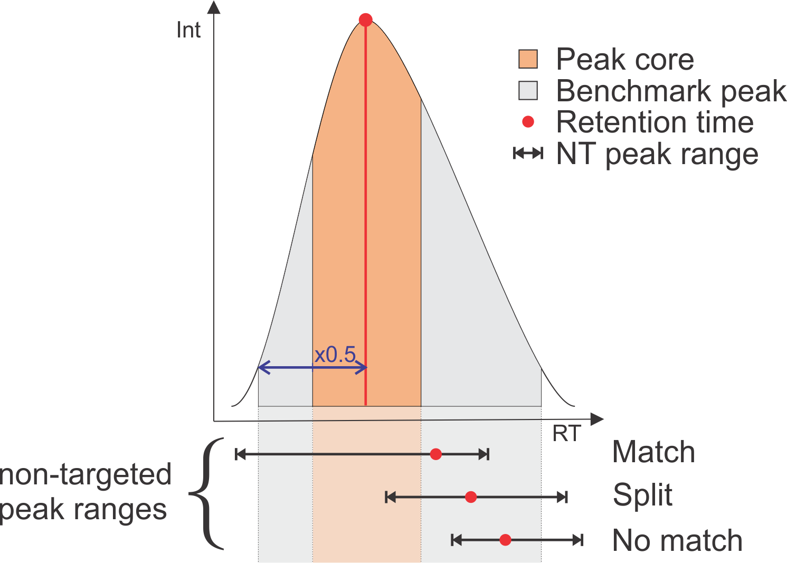
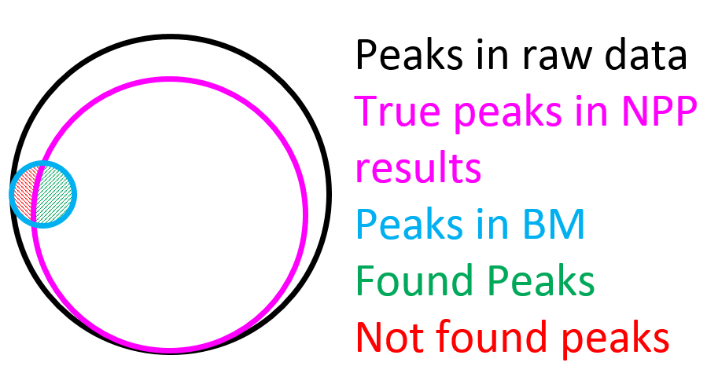
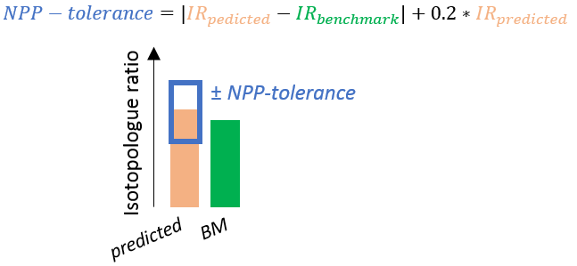
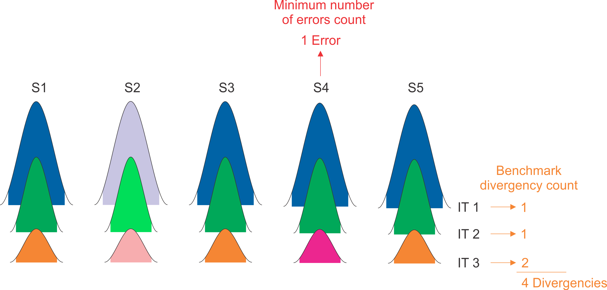

<!-- README.md is generated from README.Rmd. Please edit that file -->

```{r, include = FALSE}
knitr::opts_chunk$set(
  collapse = TRUE,
  comment = "#>",
  fig.path = "man/figures/README-",
  out.width = "100%"
)
```

<!-- badges: start -->
<!-- badges: end -->

The goal of mzRAPP is to allow reliability assessment of non-targeted data pre-processing (NPP) in the realm of liquid chromatography high resolution mass spectrometry (LC-HRMS). This is achieved by utilizing user provided information on a set of molecules (at best > 50) with known retention behavior. mzRAPP extracts and validates chromatographic peaks for all (envipat predicted) isotopologues of those target molecules directly from mzML files. The resulting benchmark dataset is used to extract different performance measures for NPP performed on the same mzML files. 


## Installation

You can install mzRAPP from [GitHub](https://github.com/) with:

``` r
if("devtools" %in% rownames(installed.packages()) == FALSE) {install.packages("devtools")}
devtools::install_github("YasinEl/mzRAPP")
```
## Usage

mzRAPP can be used via a shiny interface or via a set of functions. <br>

<h3>Benchmark dataset generation</h3>

<b>Via user interface:</b> <br>

Open mzRAPP as shiny app using:

```{r eval=FALSE} 
library(mzRAPP)
callmzRAPP()
```

Following that you can go to the 'Generate Benchmark' panel of mzRAPP:

<h4>First:</h4>
In order to generate a benchmark you need to provide your centroided mzML files as well as two additional csv files. The <u><b>sample-group file</b></u> should contain two columns: 

<b>sample_name:</b> names of all mzML files <br>
<b>sample_group:</b> group labels of the respective samples (e.g. treated, untreated,..) <br>


The <u><b>target file</b></u> should contain information on the target molecules:

<b>molecule:</b> names of target molecules (should be unique identifiers) <br>
<b>adduct_c:</b> adducts that should be evaluated (e.g. M+H or M+Na). If more than one adduct is to be investigated another line with the same molecule name should be added. All adducts enabled in the enviPat package are allowed:
```{r enviPat}
library(enviPat)
data(adducts)
adducts$Name
```
<b>main_adduct:</b> One main adduct has to be defined for each molecule (e.g. M+H). If the main_adduct is not detected also other adducts wont be accepted. <br>
<b>SumForm_c:</b> Molecular composition of the neutral molecule (e.g. C10H15N5O10P2). <br>
<b>StartTime.EIC:</b> Start time for chromatograms extracted for this molecule (seconds). <br>
<b>EndTime.EIC:</b> End time for chromatograms extracted for this molecule (seconds). <br>
<b>user.rtmin:</b> (optional) Start time of peak. This substitutes peak detection done by mzRAPP (seconds). <br>
<b>user.rtmax:</b> (optional) End time of peak. This substitutes peak detection done by mzRAPP (seconds). <br>
<b>user.rt:</b> Retention time expected for this molecule. If multiple peaks are detected the peak closest to this time is chosen (seconds). <br>

Afterwards the used <u><b>instrument and resolution</u></b> has to be selected. This is necessary in order to apply the correct mass resolution for any given m/z value. All instruments enabled via the enviPat package can be selected from the envipat resolution list. For other instruments a custom resolution list has to be uploaded as .csv file. This .csv file has to have two columns: <br>
<b>R: </b> Resolution value at half height of a mass peak <br>
<b>m/z: </b> m/z value for the correspondig resolution <br>
Resolution values for at least 10 equally distributed m/z values are recommended.

<h4>Second:</h4>
In a next step a view paramters have to be set: <br>
<b>Lowest iso. to be considered [%]:</b> Lowest relative isotopologue abundance to be considered for each molecule. <br>
<b>Min. # of scans per peak:</b> Minimum number of points for a chromatographic peak to be considered as such. <br>
<b>mz precision [ppm]:</b> Maximum spread of mass peaks in the mz dimension to be still considered part of the same chromatogram. <br>
<b>mz accuracy [ppm]:</b> Maximum difference between the accurate mz of two ion traces to be considered to be originating from the same ion. <br>
<b>Processing plan:</b> How should the benchmark generation be done? <u>sequential</u> (only using one core; often slow but does not use much RAM) or <u>multiprocess</u> (using multiple cores; faster but needs more RAM) <br>

<h4>Third:</h4>
Benchmark generation can be started using the blue Start button. The necessary time for the generation depends on the number of mzML files, the number of target compounds and of course computational recources.

<h4>Fourth:</h4>
Afterwards the generated benchmark dataset can be inspected in the "View Benchmark" panel. The plots in the first row can be used to inspect different qualities of the dataset. A molecule not being added does not necessarily mean that there is no peak, but that mzRAPP was not able to validate it. This could be because no additional isotopologue (full-filling strict criteria in abundance and peak shape correlation) coule be detected. In order to have a closer look on benchmark peaks please use the exported Skyline transition list and peak boundaries.<br>
<br>
<b>Via R-functions:</b><br>
```{r eval=FALSE}
library(mzRAPP)

#load necessary files into environment
targets <- fread("PATH_TO_TARGET_MOLECULE_FILE/TARGETS.csv")
grps <- fread("PATH_TO_SAMPLE_INFORMATION_FILE/SAMPLE_INFORMATION.csv")
files <- list.files("PATH_TO_FOLDER_WITH_MZML_FILES", recursive = TRUE, full.names = TRUE, pattern=".mzML")

#load resolution list of your choice from envipat package or via fread(Path.csv) from a .csv file
data("resolution_list", package = "enviPat")
mz_res_dependence_df <- resolution_list[["Q-Exactive,ExactivePlus_R70000@200"]]

#generate table with mass traces
MassTraces <- getMZtable(
  targets,
  instrumentRes = mz_res_dependence_df,
)

#genereate table with regions of interest
rois <- getROIsForEICs(
  files = files,
  Target.table = MassTraces,
  PrecisionMZtol = 8,
  AccurateMZtol = 5
)

#generate table with peaks
PCbp <- findBenchPeaks(
  files = files,
  Grps = grps,
  CompCol = rois,
  Min.PointsperPeak = 7
)

#reducing number of peaks to a maximum of 1 per mass trace and generating final benchmark dataset
PCal <- align_PC(PCbp)

```


<h3>Reliability assessment of non-targeted data pre-processing</h3>

The generated benchmark can now be used to assess the reliability of non-targeted data pre-processing. <br>

<b>Via user interface:</b> <br>

Such an assessment can be set up in the panel "Assess NT data pre-processing". First the tool to be evaluated has to be set. Afterwards the unaligned files (One for XCMS (csv) and Compound Discoverer (txt), multiple for mzMine (csv) and MS-DIAL (txt)) and one aligned file have to be selected. <br>
<br>
<b>How to export unaligned and aligned files from different tools:</b><br>
<br>
<u>XCMS (R-version):</u>
```{r eval=FALSE} 
#unaligned file:
data.table::fwrite(xcms::peaks(xcmsSet_object), "blabla_unaligned_file.csv")

#aligned file:
data.table::fwrite(xcms::peakTable(xcmsSet_object), "blabla_aligned_file.csv")
```

<br>
<u>XCMS online:</u> <br>
Download all results from XCMS online via the button "Download Results". Afterwards extract all Results from the zipped folder. <br>
unaligned file: select the xcms3xset.Rda file <br>
aligned file: select the same xcms3xset.Rda file <br>
<br>
<u>MS-DIAL:</u> <br>
unaligned files: Export -> Peak list result -> [Add all files] -> [set Export format to txt] <br>
aligned file: When performing the alignment make sure to activate the isotope tracking option in the alignment step (for most cases selecting 13C and 15N as labeling elements will be adequat). Afterwards export via: Export -> Alignment result -> [check Raw data matrix Area] -> [set Export format to txt] <br>
<br>
<u>mzMine:</u> <br>
unaligned files: [select all files generated in the chromatogram deconvolution step] -> Feature list methods -> Export/Import -> Export to CSV file -> [set Filename including pattern/curly brackets (e.g. blabla_{}_blabla.csv)] -> [check "Peak name", "Peak height", "Peak area", "Peak RT start", "Peak RT end", "Peak RT", "Peak m/z", "Peak m/z min" and "Peak m/z max"] -> [set Filter rows to ALL] <br>
aligned file: [select file after alignment step] -> Feature list methods -> Export/Import -> Export to CSV file -> [additional to checks set for unaligned files check "Export row retention time" and "Export row m/z"]<br>
<br>
<u>El-MAVEN:</u> <br>
unaligned file: [click the "Export csv" button in the "Peak Table"-panel] -> Export all groups -> [select "Peaks Detailed Format Comma Delimited (.csv)"] <br>
aligned file: [click the "Export csv" button in the "Peak Table"-panel] -> Export all groups -> [select "Groups Summary Matrix Format Comma Delimited (.csv)"] <br>
<br>
<u>Compound Discoverer:</u> <br>
unaligned file: [go to panel "Features"] -> [click in any row] -> [click "Show related Tables" on the bottom of the screen] -> [go to panel "Chromatogram Peaks"] -> [make sure the columns "Apex Intensity", "Area", "Study File ID", "Left RT [min]", "Right RT [min]" "Apex RT [min]" and "Apex m/z" are visible] -> [right click any row] -> Export -> As plain text... <br>
<br>
<b>Selecting a benchmark dataset and starting assessment:</b><br>
<br>
Next the benchmark file has to be selected. If a benchmark has been created during this shiny session (the benchmark is still visible in the panel benchmark overview) the switch button "Use generated benchmark" can be clicked as an alternative. If you want to adapt mzRAPP to a tool/non-targeted output format other than those mentioned above this can be done by clicking the "Use generated options" switch button. The way those option files can be generated manually is described at the bottom of this readme. <br>
<br>
After performing those steps the assessment can be started via the blue "Start assessment button". <br>

<b>Via R-functions:</b><br>
```{r eval=FALSE}
library(mzRAPP)

#set used algorith. Can be "XCMS", "msDial", "mzMine" or "CompoundDiscoverer"
algo = "XCMS"

#import generated benchmark dataset
benchmark_list <- import_benchmark(file = "PATH_TO_BENCHMARK/Benchmark.csv", 
                                   algo = algo
                                   )
#import genereated outputs from non-targeted tools 
NToutputs <- pick_algorithm(ug_table_path = "PATH_TO_BENCHMARK_NTOUTPUT_BEFORE_ALIGNMENT/UNALIGNED_OUTPUT.csv", 
                            g_table_path = "PATH_TO_BENCHMARK_NTOUTPUT_AFTER_ALIGNMENT/ALIGNED_OUTPUT.csv", 
                            options_table = benchmark_list$options_table, 
                            algo = algo
                            )

#perform comparison
comparison <- compare_peaks(b_table = NToutputs$b_table, 
                            ug_table = NToutputs$ug_table, 
                            g_table = NToutputs$g_table,
                            algo = algo
                            )

```


## Interpretation of results

<h3>Comparison of benchmark with non-targeted output</h3>

<b>Matching of benchmark peaks with NT peaks before alignment:</b> <br>
Each benchmark peak (BP) is reported the smallest and highest mz value contributing to the chromatographic peak. In order to be considered as possible match for a BP a NT peak (NP) has to come with an mz value between those to values. Matching rules considering retention time (RT) are depicted in Figure 1. A NP has to cover the whole core of a BP while having a RT within the borders (RTmin, RTmax) of the BP. If only a part of the core is covered by a NP with its RT in the borders of the BP, the NP it is counted as a split peak. NPs which are not overlapping with the core of a BP are not considered. If there is more than one NP matching to a single BP, BPs corresponding to the same molecule but other isotopologues (IT) are considered to choose the NP leading to the smalles IT ratio error as compared to the predicted IT-ratio.

```{r figure1, out.width="30%", out.height="50%", echo=FALSE,fig.cap="\\label{fig:figure1}<b>Figure 1 | </b> Matching rules of BP with NP"}

```
<br>
<b>Matching of benchmark features with non-targeted features:</b> <br>
For a NT feature (NF) to be considered as match for a benchmark feature (BF) its reported mz and RT value have to lie between the lowest/highest benchmark peak mzmin/mzmax and RTmin/RTmax of the considered benchmark feature, respectively. In case of multiple NF matching to the same BF the NF leading to smallest mean isotopologue ratio-error (as compared to the predicted ratio; see figure 3) over all NPs is selected (only NPs in samples which are also populated by a BP are considered). 

<h3>Interpretation of NPP performance metrics</h3>

Reliability assessment results can be inspected in the panel "View NPP assessment" or can be generated using R-functions (shown below). Using the shiny user interface the following performance metrics are given at the top of the panel: <br>
<br>


<u>Found peaks:</u> <br>
The number of benchmark peaks for which a match was found among the unaligned/aligned NPP results vs all peaks present in benchmark (as shown in figure 2). For explanations on how the matching of benchmark peaks with non-targeted peaks is performed please read the section "Matching of benchmark peaks with NT peaks before alignment" above.<br>

```{r figure2, out.width="30%", out.height="50%", echo=FALSE,fig.cap="\\label{fig:figure2}<b>Figure 2 | </b> Overview of different peak populations"}

```

<br>
<u>Missing peaks (h/l):</u> <br>
The classification of not found peaks (as defined in figure 1) into high and low is done for each benchmark feature individually. It is based on the lowest benchmark peak present in the respective feature which has been found by the non-targeted algorithm. All benchmark peaks in this feature which have a benchmark area which is more than 1.5 times higher than the lowest found peak are considered as high. Otherwise they are considered as low. 

<u>Split peaks:</u> <br>
The number of split peaks which have been found for all benchmark peaks. For a graphical explanation of a split peak please check figure 1. <br>

<br>
<u>Degenerated IR:</u> <br>
Isotopologue abundance rations (IR) are calculated relative to the highest isotopologue of each compound. If the relative bias of an IR calculated using NPP-abundances is exceeding the tolerance (outlined in figure 3) it is reflected in this variable. 

```{r figure3, out.width="30%", out.height="50%", echo=FALSE,fig.cap="\\label{fig:figure3}<b>Figure 3 | </b> Overview of different peak populations"}

```

<br>

<u>Alignment errors:</u><br>
Benchmark-critical counting counts the minimum number of alignment errors without relying on correct alignment of the benchmark dataset itself. Figure 4 shows three isotopologues (IT) of the same benchmark compound detected in 5 samples. The color coding indicates the feature the peak has been assigned to by the NPP aligorthm. Whenever there is an asymmetry in the assignment of the different IT the minimum number of steps to reverse that asymmetry is counted as errors. Benchmark-trustful counting is a different way of counting alignment errors, which assumes correct alignment of the benchmark dataset. Here simply the number of deviations between BM and NPP alignments is counted as errors. This kind of counting should only be done after visual inspection of the benchmark dataset. Per default benchmark-critical counting is applied. 

```{r figure4, out.width="50%", out.height="50%", echo=FALSE,fig.cap="\\label{fig:figure4}<b>Figure 4 | </b> Counting alignment errors"}

```

<b>Overview plots:</b><br>
<br>
For explanations of the overview plots please click the blue question marks above the individual plots. <br>

<b>Via R-functions:</b><br>

```{r eval=FALSE}
library(mzRAPP)


```


